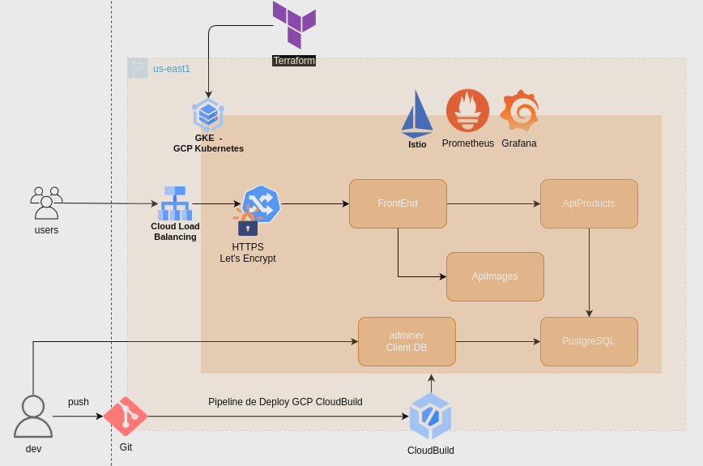
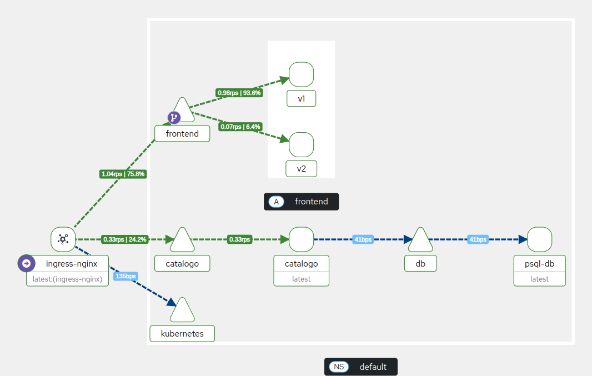

### Objetivos
 - Pipeline CI/CD cloudBuild + GKE.
 - Aplicar Certificados SSL/TLS (Let's Ebcrypt) para https.
 - Aplicar Istio para Service Mesh.
 - Aplicar Prometheus e Grafana.
 - Infra com Terraform usando modulos.


### Repositórios relacionados 
- [Frontend](https://github.com/Adenilson365/devopslabs01-frontend)
- [BackEnd - Api-Images](https://github.com/Adenilson365/devopslabs01-api-images)
- [Terraform - Infra](https://github.com/Adenilson365/devopslabs01-iac)


### Diagrama de arquitetura


### Diagrama do ServiceMesh


### Documentação
- [cert-manager](https://cert-manager.io/)
- [LetsEncrypt](https://letsencrypt.org/)
- [Ingress Nginx](https://kubernetes.github.io/ingress-nginx/deploy/#gce-gke)
- [Istio - Service Mesh](https://istio.io/)
- [Stack Prometheus + Grafana](https://artifacthub.io/packages/helm/prometheus-community/kube-prometheus-stack)

### Configuração inícial do Cluster
- Execute o terraform ou crie um cluster GKE [Repositório de IAC](https://github.com/Adenilson365/devopslabs01-iac)
- Instale a CNI ingress-nginx
- Instale a CLI do Istio 
- Aplique os arquivos de configuração 
  - Secrets
  - ConfigMaps
  - Ingress Controller
  - PersistentVolumeClaim

### Como Configurar HTTPS
- Instale o cert-manager seguindo a documentação cert-manager.
- Crie o kind ClusterIssuer seguindo: [Documentação](https://cert-manager.io/docs/tutorials/acme/nginx-ingress/)
- Adicione as configurações de Annotations e spec.tls, ainda seguin a documentação do passo anterior
```YAML
apiVersion: networking.k8s.io/v1
kind: Ingress
metadata:
  name: devopslabs
  annotations:
   cert-manager.io/cluster-issuer: letsencrypt-prod
spec:
  ingressClassName: nginx
  tls:
    - hosts:
        - meudominio.com.br
      secretName: letsencrypt-prod
```
- Pronto - HTTPS configurado.

### Intalar Istio
- [LINK](https://istio.io/latest/docs/ambient/install/platform-prerequisites/) - Aplique a configuração específica para o Kubernetes, neste projeto GKE.
- [LINK](https://istio.io/latest/docs/ambient/install/helm/) - Instale os componentes base do Istio via Helm
- [LINK](https://istio.io/latest/docs/ops/integrations/kiali/#installation) - Instale o kiali dashboard
- [LINK](https://istio.io/latest/docs/ops/integrations/grafana/) - Instale o componente Grafana
- [LINK](https://istio.io/latest/docs/ops/integrations/prometheus/) - Instale o componente Prometheus
- [LINK](https://istio.io/latest/docs/ops/integrations/jaeger/#installation) - Para Tracing instale o Jaeger

- Após instalar os componentes injete a label no namespace da aplicação.
  - Novos pods terão sidecar de proxy do istio, pods existentes precisarão ser recriados.
```
kubectl label namespace <NomeNamespace> istio-injection=enabled
```
- Instalado o profile ambient


```shell
#Kubectl Grafana
kubectl apply -f https://raw.githubusercontent.com/istio/istio/release-1.24/samples/addons/grafana.yaml
#Kubectl Prometheus
kubectl apply -f https://raw.githubusercontent.com/istio/istio/release-1.24/samples/addons/prometheus.yaml
#Kubectl Jaeger-Tracing
kubectl apply -f https://raw.githubusercontent.com/istio/istio/release-1.24/samples/addons/jaeger.yaml

```

### Variáveis de ambiente
- Secrets 
```YAML
apiVersion: v1 
kind: Secret
metadata:
  name: db-secret
type: Opaque
data:
  POSTGRES_USER: valor
  POSTGRES_PASSWORD: valor
  POSTGRES_DB: valor
---
apiVersion: v1
kind: Secret
metadata:
  name: catalogo-secret
type: Opaque
data:
  DB_HOST: valor
  DB_USER: valor
  DB_PASSWORD: valor
  DB_DATABASE: valor
```
```shell
#Como colocar em base64 para o secret
echo -d 'valor' | base64 
```


### Scripts úteis

- Criar e popular tabela no banco de dados.

```SQL
CREATE TABLE products (
    id SERIAL PRIMARY KEY,
    name VARCHAR(255) NOT NULL,
    price DECIMAL(10, 2) NOT NULL,
    imagem_id VARCHAR(50),
    category VARCHAR(100) NOT NULL,
    stars INTEGER CHECK (stars BETWEEN 0 AND 5),
    stock INTEGER NOT NULL DEFAULT 0,
    num_reviews INTEGER NOT NULL DEFAULT 0,
    created_at TIMESTAMP NOT NULL DEFAULT NOW(),
    updated_at TIMESTAMP NOT NULL DEFAULT NOW()
);


INSERT INTO products (name, price, imagem_id, category, stars, stock, num_reviews) VALUES
    ('Computador Gamer XYZ', 2999.99, '1.png', 'computadores', 5, 10, 50),
    ('Notebook Ultra Fino ABC', 3999.99, 'note.jpg', 'notebooks', 4, 5, 30),
    ('Teclado Mecânico Gamer RGB', 299.99, 'mouse.jpg', 'perifericos', 4, 20, 15),
    ('Mouse Gamer XYZ - 16000 DPI', 159.99, 'mouse.jpg', 'perifericos', 5, 25, 40),
    ('Teclado Mecânico Gamer RGB', 299.99, 'mouse.jpg', 'perifericos', 4, 20, 15),
    ('Mouse Gamer XYZ - 16000 DPI', 159.99, 'mouse.jpg', 'perifericos', 5, 25, 40),
    ('Teclado Mecânico Gamer RGB', 299.99, 'mouse.jpg', 'perifericos', 4, 20, 15),
    ('Mouse Gamer XYZ - 16000 DPI', 159.99, 'mouse.jpg', 'perifericos', 5, 25, 40),
    ('Teclado Mecânico Gamer RGB', 299.99, 'mouse.jpg', 'perifericos', 4, 20, 15),
    ('Mouse Gamer XYZ - 16000 DPI', 159.99, 'mouse.jpg', 'perifericos', 5, 25, 40),
    ('Teclado Mecânico Gamer RGB', 299.99, 'mouse.jpg', 'perifericos', 4, 20, 15),
    ('Mouse Gamer XYZ - 16000 DPI', 159.99, 'mouse.jpg', 'perifericos', 5, 25, 40),
    ('Teclado Mecânico Gamer RGB', 299.99, 'mouse.jpg', 'perifericos', 4, 20, 15),
    ('Mouse Gamer XYZ - 16000 DPI', 159.99, 'mouse.jpg', 'perifericos', 5, 25, 40),
    ('Placa de Vídeo GTX 3060', 1999.99, 'placa-mae.jpeg', 'hardware', 5, 8, 60);


```
### Opção por certificado auto-gerenciado 
[Google Docs](https://cloud.google.com/load-balancing/docs/ssl-certificates/self-managed-certs?hl=pt-br)
[OpenSSL](https://openssl-library.org/source/)

- Crie a chave privada: 
```
openssl genrsa -out meudominio.com.br.pem 2048

```
- Crie a request :

```
openssl req -new -key meudominio.com.br.key  -out meudominio.com.br.csr.pem
```
- Crie o certificado auto-gerenciado.
```
openssl x509 -req -days 365 -in meudominio.com.br.csr.pem -signkey meudominio.com.br.pem  -out meudonio.com.br.cer.pem

```